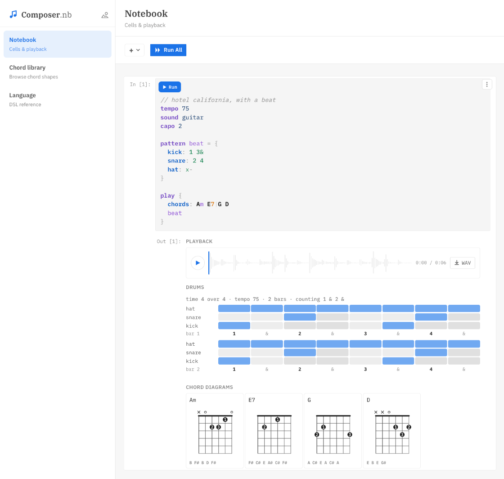
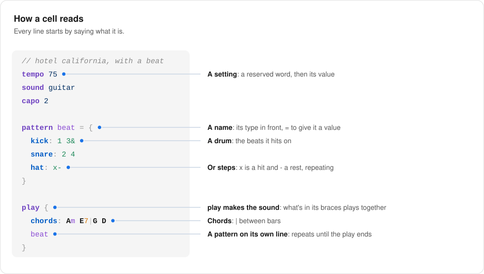
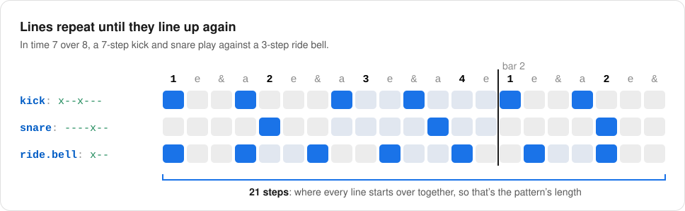
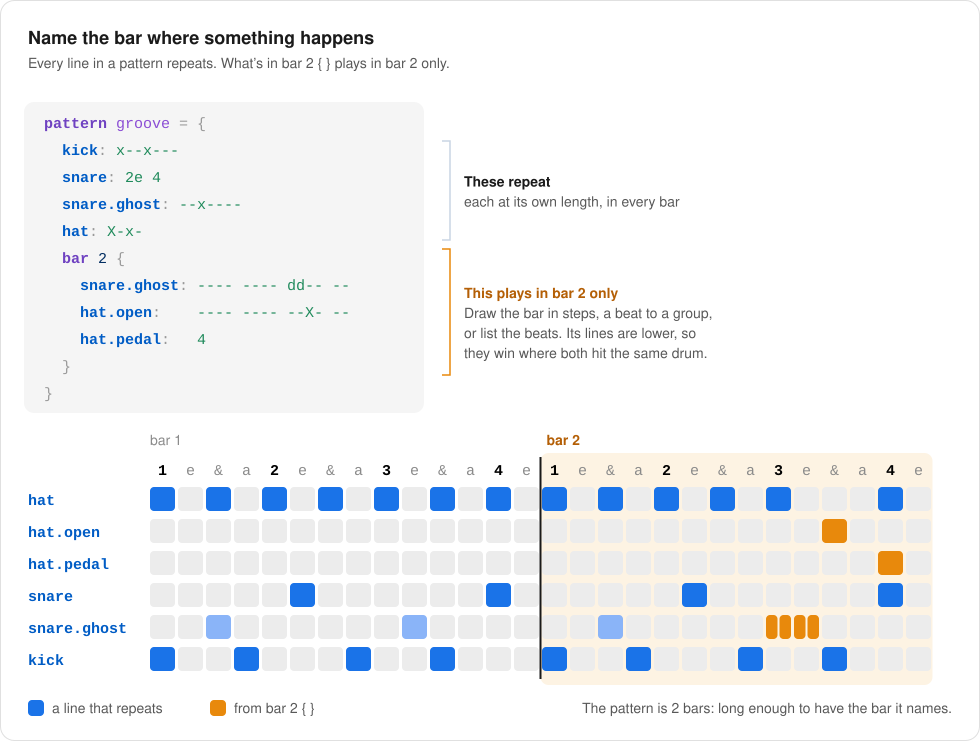

# composer-nb

**Sketch music like you write code.** Chords and drums in a small language you can read at a glance. Run a cell and hear it, with a drum grid, chord shapes for guitar, and a WAV to keep. It runs in your browser, and right inside Jupyter.

**[Open the playground →](https://composer-nb.vercel.app)** · `pip install composer-nb`

<p align="center">
  
</p>

## How a cell reads

Every line starts by saying what it is: a setting, a name with its type, an instrument and what it plays, or `play`. Nothing makes a sound unless it's inside a `play`.

<p align="center">
  
</p>

## Patterns repeat until they line up

Everything in a pattern repeats until the pattern ends. Give lines different lengths and they drift against each other, so odd meters and polyrhythms take a line each:

```
// what happens now: crash once, the groove repeating under it
time 7 over 8

pattern groove = 3 bars {
  kick: x--x---
  snare: ----x--
  ride.bell: x--
}

play 6 bars {
  crash: 1
  groove
}
```

<p align="center">
  
</p>

A play is a timeline: its own lines play once, so the crash hits once while the groove repeats under it. Anything that repeats has to fit what it's in, and if it doesn't, the error says where it lines up.

## Name the bar where something happens

A drum's line is a picture of time (`x--x---`), or the beats it hits on (`2e 4`). Either way it repeats in every bar. For something that happens in one bar only, like a lift at the end of a groove, put the bar in front of it. And instead of counting out a long run of `-`, put a length in front of `rest`:

```
time 7 over 8
tempo 90

pattern groove = {
  kick: x--x---
  snare: 2e 4
  snare.ghost: --x----
  hat: X-x-
  bar 2 {
    snare.ghost: 2 beats rest, dd, 1 beats rest
    hat.open:    2 beats rest, --X-, 2 steps rest
    hat.pedal:   4
  }
}

play 6 bars {
  crash: 1
  groove
}
```

<p align="center">
  
</p>

## In Jupyter

```bash
pip install composer-nb
```

```python
%load_ext composer_nb
```

Then start a cell with `%%music`. Each `play` gives a player, a waveform, a drum grid and the chords it heard, and Tab completes as you type. Named cells carry their settings and names into later ones. See the [package README](dsl/README.md) for the rest.

## What's here

| Folder        | What it is                                                                                                                                                                                   |
| ------------- | -------------------------------------------------------------------------------------------------------------------------------------------------------------------------------------------- |
| `dsl/`        | The language. `dsl/js/` has the parser, chord builder and audio renderer. `dsl/python/` is the [`composer-nb`](dsl/README.md) Python package, which plays the language in Jupyter notebooks. |
| `playground/` | A notebook-style web app for writing the language and hearing it. It uses `dsl/` as a package, so both always run the same parser.                                                           |
| `docs/`       | Design notes, screenshots, and the images in these READMEs.                                                                                                                                  |

## Working on it

```bash
npm install     # installs both folders (npm workspaces)
npm run dev     # playground at http://localhost:5173
npm test        # language tests
npm run lint
npm run build   # builds the notebook widget and the playground
```

The Python package needs the widget built first:

```bash
npm run build -w dsl
pip install -e "dsl[test]"
pytest dsl/tests/python
```

## Releasing the Python package

Releases go to [PyPI](https://pypi.org/project/composer-nb/) from GitHub Actions ([`publish.yml`](.github/workflows/publish.yml)), so no API tokens are stored anywhere.

One-time setup, on [pypi.org](https://pypi.org/manage/account/publishing/): add a pending trusted publisher with project `composer-nb`, owner `pkhambat1`, repository `composer-nb`, workflow `publish.yml` and environment `pypi`.

For each release:

1. Bump `version` in `dsl/pyproject.toml` and merge it to `main`.
2. Create a GitHub release with a tag that matches, like `v0.1.0`.

The workflow builds the widget and the package, checks that the tag matches the version, and uploads it to PyPI.

## Releasing the playground

The playground is a static site on [Vercel](https://vercel.com), built from this repository. Its build settings are in [`vercel.json`](vercel.json): it builds the `playground` workspace and serves `playground/dist`.

The Vercel project is `composer-nb`, served at [composer-nb.vercel.app](https://composer-nb.vercel.app). There is nothing to do for each release: every merge to `main` deploys the playground, and every pull request gets a preview link.
